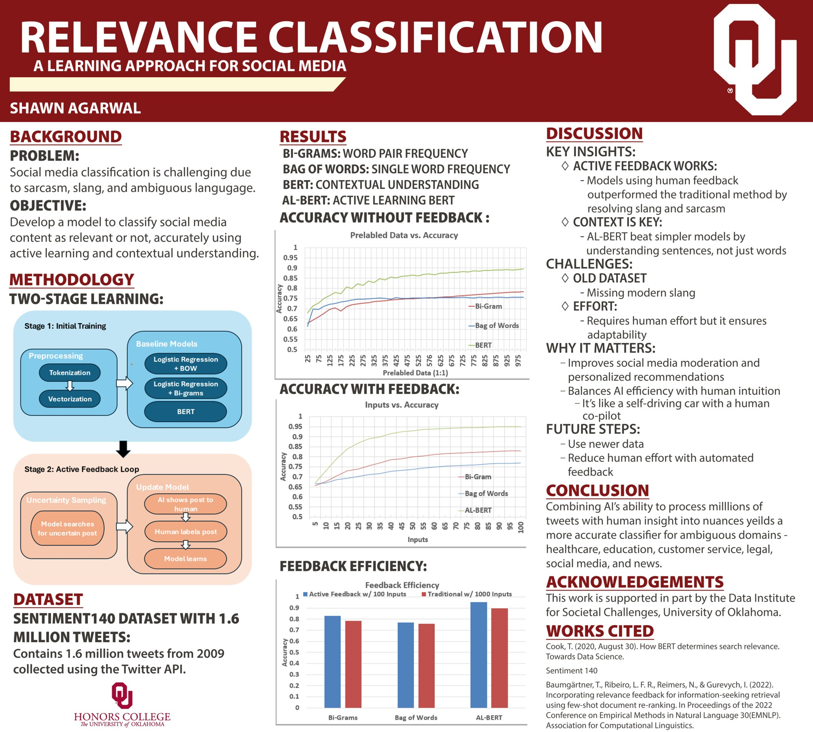

# Relevance Classification

This project is for my First Year Research Experience at the University of Oklahoma. I am doing this project under the supervision of Data Institute for Societal Challenges faculty Dr. Wolfgang. 

The goal is to create a "search engine" for social media posts. To do this I created an algorithm based upon active feedback through uncertainty sampling. 

## Poster

Presented at the University of Oklahoma First-Year Research Experience (FYRE). Click for full resolution.

## Background

**Problem:** Classifying social media posts is hard because of sarcasm, slang, and ambiguous language.

**Objective:** Build a model that labels social media content as relevant or not, using active learning and contextual understanding.

## Dataset

[Sentiment140](http://help.sentiment140.com/): 1.6 million tweets from 2009, collected with the Twitter API.

## Methodology

Two-stage learning:

1. **Initial training.** Tweets are preprocessed (tokenization, vectorization) and used to train three baselines:
   - Logistic regression + bag of words (single-word frequency)
   - Logistic regression + bi-grams (word-pair frequency)
   - BERT (contextual understanding)
2. **Active feedback loop.** Using uncertainty sampling, the model finds the post it is least sure about and shows it to a human. The human labels it, and the model updates. Applied to BERT, this is **AL-BERT** (active-learning BERT).

## Results

Approximate accuracy, read from the poster's charts:

| Model | Without feedback (1,000 prelabeled) | With active feedback (100 inputs) |
| --- | --- | --- |
| Bag of words | ~0.76 | ~0.77 |
| Bi-grams | ~0.78 | ~0.83 |
| BERT / AL-BERT | ~0.89 | **~0.95** |

With 100 actively chosen labels, every model matched or beat the same model trained on 1,000 traditional labels. AL-BERT did best.

## Discussion

- **Active feedback works.** Models that got human feedback beat the traditional method, because the feedback resolved slang and sarcasm.
- **Context is key.** AL-BERT beat the simpler models because it understands whole sentences, not just individual words.
- **Challenges.** The 2009 dataset is missing modern slang, and the loop needs human effort, though that effort is what lets the model adapt.
- **Future steps.** Use newer data, and cut human effort with automated feedback.

Combining a model's ability to process millions of tweets with human insight into nuance produces a more accurate classifier for ambiguous domains such as healthcare, education, customer service, legal, social media, and news.

## Code

| File | Purpose |
| --- | --- |
| `download_and_filter.py`, `load_data.py`, `preprocess.py` | Load and preprocess Sentiment140 |
| `create_test_set.py` | Build the held-out test set |
| `bag of words/` | Bag-of-words baseline training and evaluation |
| `train_bag_of_words_feedback.py` | Bag-of-words model with the active feedback loop |
| `train_sequential_feedback.py` | Sequential (Keras) model with the feedback loop |
| `train_bert_feedback.py` | AL-BERT |
| `test_active_feedback_models.py` | Evaluate the feedback-trained models |

## Acknowledgements

This work is supported in part by the Data Institute for Societal Challenges, University of Oklahoma.

## References

- Cook, T. (2020, August 30). How BERT determines search relevance. *Towards Data Science*.
- Sentiment140.
- Baumgärtner, T., Ribeiro, L. F. R., Reimers, N., & Gurevych, I. (2022). Incorporating relevance feedback for information-seeking retrieval using few-shot document re-ranking. In *Proceedings of the 2022 Conference on Empirical Methods in Natural Language Processing (EMNLP)*. Association for Computational Linguistics.
